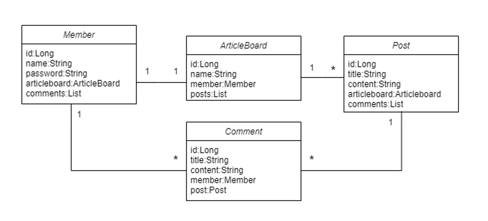

2024.09.01~2024.09.05

# About

본 개인 프로젝트에서는 spring을 사용하여 간단한 웹 게시판을 개발한다.

spring core, spring mvc, H2, jpa 등을 사용한다.

# 요구사항 정리

### 기능 목록

본 시스템에서 요구되는 기능 목록은 아래와 같다.

1. 회원 관리

   회원 로그인 / 회원 가입 / 로그아웃

   로그인 상태가 아닌 접근은 /login으로 리다이렉트하도록 처리해야 한다.

2. 회원 별 글 게시판 관리

   글 목록 조회 / 타 회원 게시판 조회

3. 글 관리

   글 등록 / 글 조회 / 글 수정 / 글 삭제

4. 댓글 관리

   댓글 작성

5. 회원 별 권한 관리

   글 등록, 수정, 삭제는 자신의 게시판과 글에 대해서만 수행이 가능해야한다.

   댓글 작성은 모든 게시판에 대해 수행이 가능해야한다.

### 화면 구성

- 로그인 화면

  name/pw 입력 폼, 제출 버튼 , 회원가입 버튼

  잘못된 입력인 경우 메시지 출력

- 회원가입 화면

  name/pw/board name 입력 폼, 제출 버튼, 취소 버튼

  잘못된 입력인 경우 메시지 출력

- 개인 게시판 화면

  게시판 이름, 로그아웃 버튼, 전체 게시판 둘러보기 버튼, 글 목록, 글쓰기 버튼

  글 제목 누르면 글 내용 화면으로 이동.

- 글 작성 화면

  게시판 이름, 로그아웃 버튼, 전체 게시판 둘러보기 버튼, 글 제목, 글 내용 입력 폼, 제출 버튼, 취소 버튼

- 글 내용 화면

  게시판 이름, 로그아웃 버튼, 전체 게시판 둘러보기 버튼, 글 제목, 글 내용,
  글 삭제/수정 버튼, 댓글 제목, 댓글 내용, 댓글 작성 폼, 제출 버튼

- 글 수정 화면

  게시판 이름, 로그아웃 버튼, 전체 게시판 둘러보기 버튼, 글 제목, 글 내용 수정 폼, 제출 버튼, 취소 버튼

- 전체 게시판 목록 화면

  전체 게시판 목록, 뒤로 버튼(원래의 게시판으로 이동).

  게시판 이름 누르면 게시판으로 이동.

### URL 구성

**/login** 
GET : 로그인 화면으로 응답. 
POST : HTML 폼으로 전송한 로그인 정보 검사, 로그인하고 /user/{username}으로 리다이렉트.

**/signup** 
GET : 회원가입 화면으로 응답. 
POST : HTML 폼으로 전송한 회원가입 정보로 회원가입하고 /login으로 리다이렉트.

**/logout** 
GET : 로그아웃 수행, /login으로 리다이렉트.

**/user/{username}** 
GET : username에 해당하는 개인 게시판 화면으로 응답.

**/user/{username}/write** 
GET : 글 작성 화면으로 응답. 
POST : HTML 폼으로 전송한 글 정보로 글 작성하고 /user/{username}으로 리다이렉트.

**/user/{username}/{글id}** 
GET : 글 내용 화면으로 응답. 
POST : HTML 폼으로 전송한 댓글 정보로 댓글 작성하고 /user/{username}/{글id}으로 리다이렉트(재출력).

**/user/{username}/{글id}/delete** 
GET : 글 삭제, /user/{username}으로 리다이렉트.

**/user/{username}/{글id}/update** 
GET : 글 수정 화면으로 응답. 
POST : HTML 폼으로 전송한 글 정보로 글 수정하고 /user/{username}/{글id}으로 리다이렉트.

**/user/all** 
GET : 전체 게시판 목록 화면으로 응답.

### 엔티티 모델

엔티티 모델은 아래와 같음.

